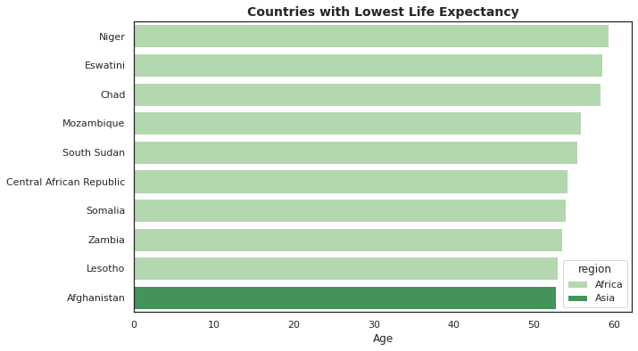
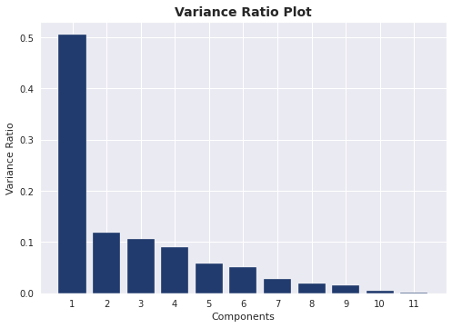
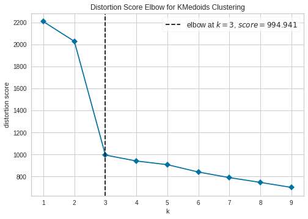
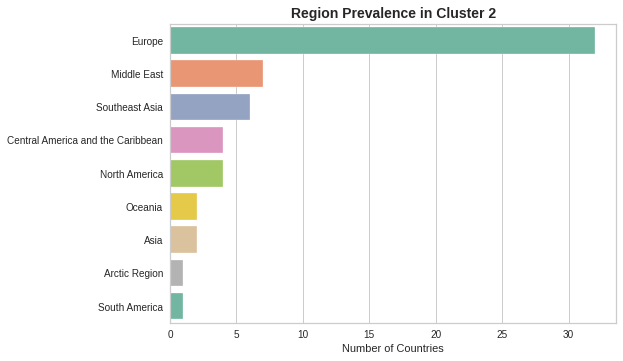

# CIA World Factbook Clustering Analysis

## Project Outline: 

The global divide between rich and poor countries gets wider every year. While some countries enjoy extraordinary wealth, other countries get left behind. A common way to try and reduce this inequality is for NGOs to supply aid to countries which are struggling in key areas such as health, wellbeing, income and other key socioeconomic measures. One problem, however, is that it can be difficult to identify which countries to prioritise. In this analysis, I take the most recent data from the CIA World Factbook and use clustering to identify which countries are most in need of aid.

[Click here to view the notebook in nbviewer](https://nbviewer.jupyter.org/github/dan-grant-hunter/CIA_World_Factbook/blob/main/cia_world_factbook_clustering_analysis.ipynb)

## Results from Clustering

From the analysis, the following 11 countries were identified as requiring aid the most:

| Countries Most in Need of Aid |
| :- |
| Afghanistan |
| Benin |
| Central African Republic |
| Chad |
| The Democratic Republic of Congo |
| Guinea |
| Guinea-Bissau |
| Mali |
| Niger |
| Sierra Leone |
| South Sudan |

## Code and Resources Used 
**Python Version:** 3.8.5  
**Packages:** pandas, numpy, matplotlib, seaborn, scikit-learn, scikit-learn-extra, yellowbrick

## About the Data

The data used in this analysis was taken from The World Factbook &ndash; a reference resource produced by the Central Intelligence Agency (CIA) of the United States. It provides basic intelligence on the history, people, government, economy, energy, geography, communications, transportation, military, terrorism, and transnational issues for 266 world entities.

Unfortunately, The World Factbook is only available as an HTML file on the CIA website, however, an API has been developed by [Ian Coleman](https://github.com/iancoleman) which enables users to obtain the data in a machine-readable format. The API parses the data from the original Factbook HTML file and converts it into a JSON data structure. The API also checks for updates frequently ensuring that there is always access to the most recent data.

Links to the data and API can be found below:

**Source Data (CIA):** https://www.cia.gov/the-world-factbook/

**API & Factbook JSON:** https://github.com/iancoleman/cia_world_factbook_api

## EDA

Below are a few highlights from the analysis. 

  

 

 

 

## Future Recommendations

While we were able to identify 11 countries that require the most aid, we did have to eliminate some countries, mostly small island nations, due to insufficient data. In the future, it may be advantageous to collect more data from these nations so we can accurately assess their needs compared to other countries. 

We could also combine data from the World Factbook with other data sources such as the Human Freedom Index or the World Happiness Report to better understand the quality of life of people from different countries. This may open up fruitful research avenues that could help to establish priorities and develop strategies focused on reducing the gap between rich developed countries and poorer less-developed countries.
